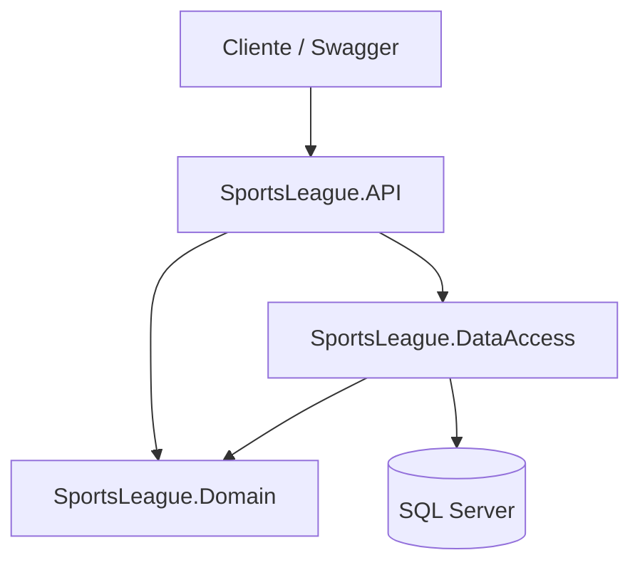
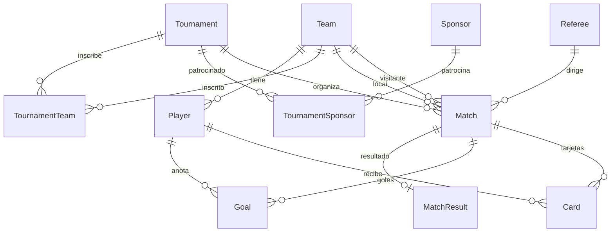

# SportsLeague API

API REST para la gestión de una liga deportiva de fútbol, desarrollada con **ASP.NET Core** y **Entity Framework Core**. Permite administrar equipos, jugadores, torneos, partidos, eventos en vivo (goles y tarjetas), patrocinadores y estadísticas calculadas en tiempo real.

## Características

- **Equipos y jugadores** — CRUD con validaciones (número de camiseta único por equipo).
- **Árbitros** — Gestión de árbitros por nacionalidad.
- **Torneos** — Ciclo de vida con máquina de estados (`Pending` → `InProgress` → `Finished`).
- **Inscripción de equipos** — Relación N:M entre torneos y equipos.
- **Patrocinadores** — Relación N:M con torneos y monto de contrato.
- **Partidos (Match)** — Programación con equipos local/visitante, árbitro y validaciones de negocio.
- **Eventos de partido** — Goles, tarjetas y resultado final con reglas por estado del partido.
- **Estadísticas** — Tabla de posiciones, goleadores y ranking de tarjetas (LINQ, sin tablas extra).
- **DataSeeder** — Poblado automático con 20 equipos de la Liga BetPlay 2026-I al iniciar la API.

## Stack tecnológico

| Tecnología | Uso |
|------------|-----|
| .NET 10 | Framework |
| ASP.NET Core Web API | Capa de presentación |
| Entity Framework Core 8 | ORM y migraciones |
| SQL Server | Base de datos |
| AutoMapper | Mapeo DTO ↔ Entidades |
| Swagger / OpenAPI | Documentación interactiva |

## Arquitectura

El proyecto usa **arquitectura en capas** (Clean Architecture simplificada). Cada capa tiene una responsabilidad clara y las dependencias van hacia adentro: la API depende del Domain y DataAccess, pero el Domain no conoce la API ni EF Core.



**Flujo general de una petición:**

```
HTTP Request → Controller → Service → Repository → LeagueDbContext → SQL Server
```

### Dependencias entre proyectos

```
SportsLeague.API
    ├── → SportsLeague.Domain
    └── → SportsLeague.DataAccess

SportsLeague.DataAccess
    └── → SportsLeague.Domain

SportsLeague.Domain
    └── (sin dependencias de API ni EF; solo Logging.Abstractions)
```

## Estructura del repositorio

```
SportLeague/
├── SportsLeague.API/                 # Capa de presentación (HTTP)
│   ├── Controllers/                  # 8 controladores REST
│   ├── DTOs/
│   │   ├── Request/                  # Datos de entrada (POST, PUT)
│   │   └── Response/                 # Datos de salida (GET)
│   ├── Mappings/MappingProfile.cs    # AutoMapper
│   ├── Program.cs                    # DI, Swagger, migrate, seed
│   └── appsettings.json
│
├── SportsLeague.Domain/              # Núcleo: reglas de negocio
│   ├── Entities/                     # 12 entidades
│   ├── Enums/                        # Estados y tipos
│   ├── Interfaces/
│   │   ├── Repositories/             # Contratos de acceso a datos
│   │   └── Services/                 # Contratos de servicios
│   ├── Services/                     # Lógica de negocio
│   └── Helpers/                      # Validaciones reutilizables
│
└── SportsLeague.DataAccess/          # Persistencia
    ├── Context/LeagueDbContext.cs    # EF Core + Fluent API
    ├── Repositories/                 # Implementación de repositorios
    ├── Migrations/                   # Historial de la BD
    └── Seeders/DataSeeder.cs         # Datos iniciales Liga BetPlay
```

## Capas en detalle

### 1. `SportsLeague.API` — Presentación

Puerta de entrada HTTP. **No** contiene lógica de negocio ni acceso directo a la base de datos.

| Carpeta / archivo | Responsabilidad |
|-------------------|-----------------|
| `Controllers/` | Reciben peticiones, devuelven JSON y códigos HTTP |
| `DTOs/Request/` | Modelos de entrada del cliente |
| `DTOs/Response/` | Modelos de salida (incluye DTOs de reporte: standings, goleadores) |
| `Mappings/` | Convierte DTO ↔ Entidad con AutoMapper |
| `Program.cs` | Registro de servicios (DI), pipeline, migraciones y seed |

**Controladores:**

| Controlador | Ruta base | Función |
|-------------|-----------|---------|
| `TeamController` | `/api/Team` | CRUD de equipos |
| `PlayerController` | `/api/Player` | CRUD de jugadores |
| `RefereeController` | `/api/Referee` | CRUD de árbitros |
| `TournamentController` | `/api/Tournament` | Torneos + inscripción de equipos |
| `SponsorController` | `/api/Sponsor` | Patrocinadores + vínculos N:M |
| `MatchController` | `/api/Match` | Programación y estado de partidos |
| `MatchEventController` | `/api/match/{matchId}` | Goles, tarjetas y resultado |
| `StandingsController` | `/api` | Standings, goleadores, tarjetas |

### 2. `SportsLeague.Domain` — Dominio

Corazón del sistema: entidades, reglas y contratos. **Independiente** de ASP.NET y EF Core.

| Carpeta | Contenido |
|---------|-----------|
| `Entities/` | Modelos del dominio (`Team`, `Match`, `Goal`...) |
| `Enums/` | `MatchStatus`, `TournamentStatus`, `GoalType`, `CardType`... |
| `Interfaces/Repositories/` | `ITeamRepository`, `IMatchRepository`... |
| `Interfaces/Services/` | `IMatchService`, `IStandingsService`... |
| `Services/` | Validaciones, máquinas de estado, cálculos LINQ |
| `Helpers/` | `MatchValidationHelper` (jugador en partido, minuto válido) |

**Servicios de negocio:**

| Servicio | Rol |
|----------|-----|
| `TeamService`, `PlayerService`, `RefereeService` | CRUD con validaciones |
| `TournamentService` | Torneos, inscripciones, cambio de estado |
| `SponsorService` | Patrocinadores y contratos con torneos |
| `MatchService` | Programar partidos, transiciones de estado |
| `MatchEventService` | Goles, tarjetas, resultado final |
| `StandingsService` | Estadísticas calculadas (solo lectura) |

### 3. `SportsLeague.DataAccess` — Datos

Implementa el acceso a SQL Server con Entity Framework Core.

| Carpeta | Rol |
|---------|-----|
| `Context/` | `LeagueDbContext`: `DbSet`, relaciones 1:1, 1:N, N:M, `DeleteBehavior` |
| `Repositories/` | `GenericRepository<T>` + repositorios específicos con `.Include()` |
| `Migrations/` | Cambios versionados del esquema de BD |
| `Seeders/` | Poblado inicial condicional (solo si `Teams` está vacía) |

**Patrón Repository:**

```
IGenericRepository<T>  ←──  GenericRepository<T>
        ↑
ITeamRepository  ←──  TeamRepository
IMatchRepository ←──  MatchRepository
... (uno por entidad principal)
```

`GenericRepository` centraliza Create, Read, Update y Delete. Los repositorios específicos añaden consultas como `GetByTournamentWithDetailsAsync`.

## Modelo de entidades

Todas las entidades heredan de `AuditBase` (`Id`, `CreatedAt`, `UpdatedAt`).



**Relaciones destacadas:**

| Relación | Tipo | Notas |
|----------|------|-------|
| `Match` → `Team` (local / visitante) | 2× FK a la misma tabla | `DeleteBehavior.Restrict` (evita ciclos de cascada) |
| `MatchResult` → `Match` | 1:1 | Índice único en `MatchId` |
| `TournamentTeam` | N:M | Un equipo solo una vez por torneo |
| `TournamentSponsor` | N:M | Monto de contrato por vínculo |

## Flujo de una petición (ejemplo)

Crear un partido: `POST /api/Match`

```
1. MatchController
   └─ Recibe MatchRequestDTO
   └─ AutoMapper → entidad Match

2. MatchService.CreateAsync()
   └─ Valida: torneo InProgress
   └─ Valida: equipos distintos y inscritos
   └─ Valida: árbitro existe

3. MatchRepository.CreateAsync()
   └─ Asigna CreatedAt, guarda en BD

4. Respuesta 201 Created con MatchResponseDTO
```

## Arranque de la aplicación

En `Program.cs`, al iniciar la API:

1. **Registro DI** — repositorios, servicios, AutoMapper, `DbContext`
2. **`MigrateAsync()`** — crea/actualiza la base de datos
3. **`DataSeeder.SeedAsync()`** — puebla datos si la BD está vacía
4. **Swagger + endpoints** — API lista para usar

```csharp
using (var scope = app.Services.CreateScope())
{
    var context = scope.ServiceProvider.GetRequiredService<LeagueDbContext>();
    await context.Database.MigrateAsync();
    await DataSeeder.SeedAsync(context);
}
```

> Se usa `CreateScope()` porque `DbContext` es **Scoped** y no puede resolverse desde el contenedor raíz.

## Requisitos previos

- [.NET 10 SDK](https://dotnet.microsoft.com/download)
- [SQL Server](https://www.microsoft.com/sql-server) (LocalDB, Express o Developer)
- [EF Core CLI](https://learn.microsoft.com/ef/core/cli/dotnet) (opcional, para migraciones manuales)

```bash
dotnet tool install --global dotnet-ef
```

## Configuración

1. Clona el repositorio:

```bash
git clone <url-del-repositorio>
cd SportLeague
```

2. Ajusta la cadena de conexión en `SportsLeague.API/appsettings.json`:

```json
{
  "ConnectionStrings": {
    "DefaultConnection": "Server=localhost;Database=LastVersionDB_API_SportsLeague;Trusted_Connection=true;TrustServerCertificate=true;"
  }
}
```

3. Ejecuta la API (aplica migraciones y seed automáticamente):

```bash
dotnet run --project SportsLeague.API
```

4. Abre Swagger en el navegador:

```
https://localhost:<puerto>/swagger
```

> Al arrancar, la aplicación ejecuta `MigrateAsync()` y el **DataSeeder** si la tabla `Teams` está vacía.

## DataSeeder (Liga BetPlay 2026-I)

Si la base de datos está vacía, se crean automáticamente:

| Entidad | Cantidad |
|---------|----------|
| Equipos | 20 |
| Jugadores | 80 (4 por equipo) |
| Árbitros | 4 |
| Torneos | 1 (`InProgress`) |
| Inscripciones | 20 |

El torneo queda listo para programar partidos sin datos manuales.

## Migraciones (manual)

Si prefieres aplicar migraciones por separado:

```bash
dotnet ef database update \
  --project SportsLeague.DataAccess \
  --startup-project SportsLeague.API
```

Crear una nueva migración:

```bash
dotnet ef migrations add NombreMigracion \
  --project SportsLeague.DataAccess \
  --startup-project SportsLeague.API
```

## Endpoints principales

### Recursos base

| Recurso | Ruta base | Operaciones |
|---------|-----------|-------------|
| Equipos | `/api/Team` | GET, POST, PUT, DELETE |
| Jugadores | `/api/Player` | GET, GET `/team/{teamId}`, POST, PUT, DELETE |
| Árbitros | `/api/Referee` | GET, POST, PUT, DELETE |
| Torneos | `/api/Tournament` | GET, POST, PUT, DELETE, PATCH `/status`, POST/GET `/teams` |
| Patrocinadores | `/api/Sponsor` | CRUD + vínculos con torneos |

### Partidos

| Método | Ruta | Descripción |
|--------|------|-------------|
| GET | `/api/Match/tournament/{tournamentId}` | Partidos de un torneo |
| GET | `/api/Match/{id}` | Partido con detalles |
| POST | `/api/Match` | Programar partido |
| PUT | `/api/Match/{id}` | Editar (solo `Scheduled`) |
| DELETE | `/api/Match/{id}` | Eliminar (solo `Scheduled`) |
| PATCH | `/api/Match/{id}/status` | Cambiar estado del partido |

### Eventos de partido (rutas anidadas)

| Método | Ruta | Descripción |
|--------|------|-------------|
| POST/GET | `/api/match/{matchId}/goals` | Registrar / listar goles |
| DELETE | `/api/match/{matchId}/goals/{goalId}` | Eliminar gol |
| POST/GET | `/api/match/{matchId}/cards` | Registrar / listar tarjetas |
| DELETE | `/api/match/{matchId}/cards/{cardId}` | Eliminar tarjeta |
| POST/GET | `/api/match/{matchId}/result` | Registrar / consultar resultado |

### Estadísticas (solo lectura)

| Método | Ruta | Descripción |
|--------|------|-------------|
| GET | `/api/standings?tournamentId={id}` | Tabla de posiciones |
| GET | `/api/stats/scorers?tournamentId={id}` | Tabla de goleadores |
| GET | `/api/stats/cards?tournamentId={id}` | Ranking de tarjetas |

## Reglas de negocio destacadas

### Torneos
- Solo se programan partidos cuando el torneo está en `InProgress`.
- Los equipos local y visitante deben estar inscritos en el torneo.

### Partidos
- Local y visitante deben ser equipos distintos.
- Transiciones de estado: `Scheduled` → `InProgress` → `Finished` o `Suspended`.

### Eventos
- Goles y tarjetas: solo en partidos `InProgress` o `Finished`.
- El jugador debe pertenecer a uno de los dos equipos del partido.
- Minuto válido: entre 1 y 120.
- Resultado: solo en partidos `Finished`, un resultado por partido.

### Tabla de posiciones
- Victoria = 3 pts · Empate = 1 pt · Derrota = 0 pts
- Desempate: Puntos → Diferencia de gol → Goles a favor
- Los autogoles no cuentan en la tabla de goleadores

## Fases implementadas

| Fase | Contenido |
|------|-----------|
| 1–3 | Equipos, jugadores, árbitros, torneos |
| 3 | Patrocinadores (N:M) |
| 4 | Partidos y programación |
| 5 | Resultados, goles y tarjetas |
| 5.1 | DataSeeder Liga BetPlay |
| 6 | Standings y estadísticas |

## Licencia

Proyecto académico — uso educativo.
